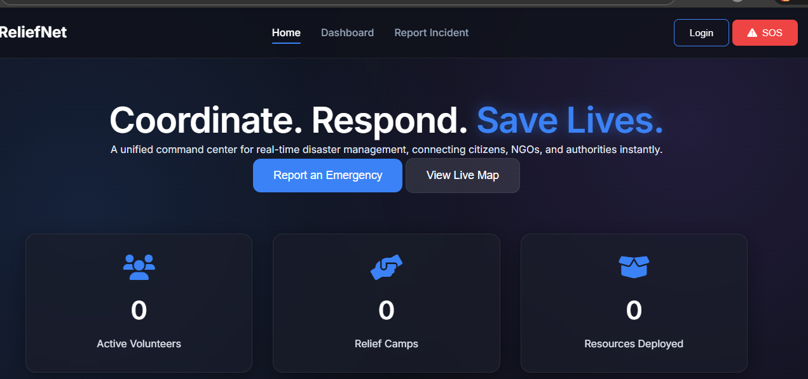
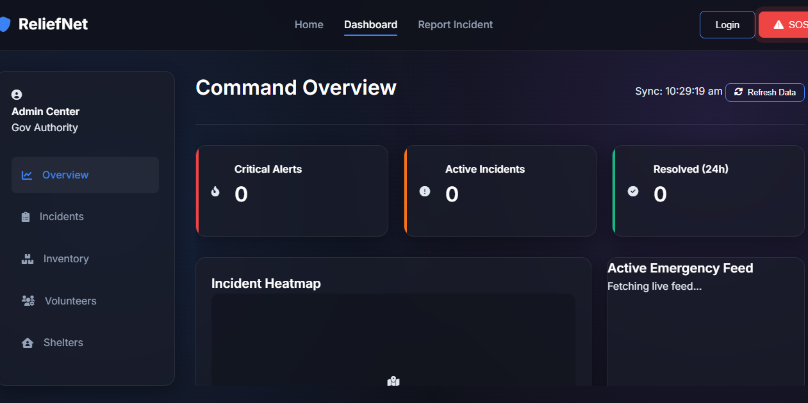
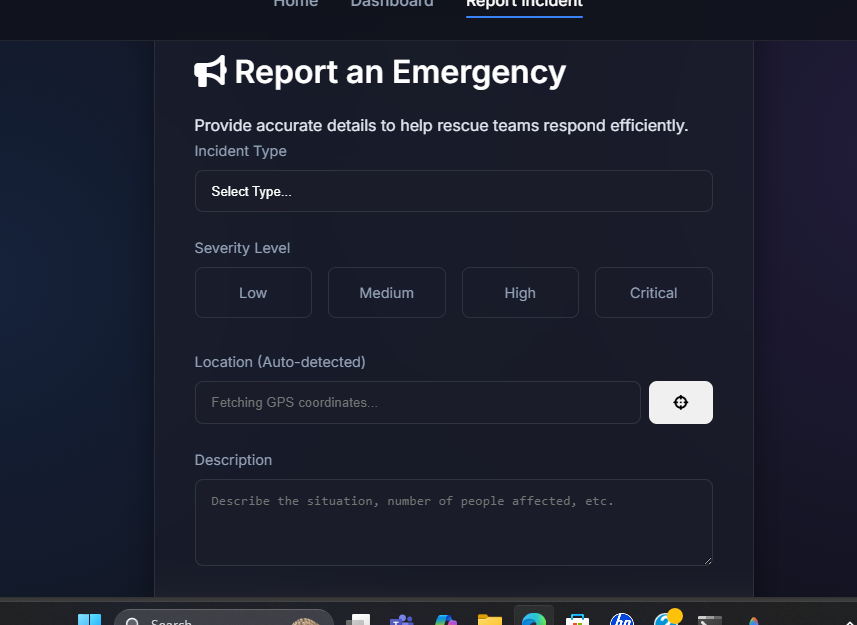

<p align="center">
  
</p>

# ReliefNet 🎯

## basic details: a disaster relief management platform for emergency assurance and fulfilling needs


### Team Name: [Name]

### Team Members
- Member 1: [karthu Rajan] - [College of engineering attingal]
- Member 2: [Name] - [College]

### Hosted Project Link
[mention your project hosted link here]

### Project Description
ReliefNet is a comprehensive disaster relief management platform designed to coordinate emergency responses in real-time. It provides a unified command center for citizens to report incidents, while allowing volunteers and authorities to coordinate resources, manage shelters, and track relief activities efficiently.

### The Problem statement
During disasters, fragmented communication and a lack of real-time data often lead to delayed rescue efforts and inefficient resource distribution. Affected citizens struggle to report emergencies reliably, and relief organizations face challenges in coordinating volunteers and tracking supplies.

### The Solution
ReliefNet solves these issues by providing:
- **Real-time Incident Reporting**: Citizens can report emergencies with location data and media attachments.
- **SOS System**: A critical alert mechanism that triggers automated SOS responses and SMS notifications.
- **Unified Dashboard**: A command center for authorities to monitor incidents, track resources, and assign volunteers.
- **Resource Management**: Tracking of inventory (food, water, medical supplies) and shelter capacities.
- **Volunteer Coordination**: A centralized database to manage volunteer availability and skills.

---

## Technical Details

### Technologies/Components Used

**For Software:**
- Languages used: JavaScript, Python, HTML, CSS
- Frameworks used: Flask
- Libraries used: Werkzeug (for file handling), SQLite3
- Tools used: Antigravity AI, Git, GitHub

---

## Features

List the key features of your project:
- Feature 1: **SOS Alert System** - Instant emergency signal transmission with automated SMS triggering for mobile users.
- Feature 2: **Real-time Incident Reporting** - Dynamic incident logging with location auto-detection and media upload capabilities.
- Feature 3: **Command Dashboard** - Real-time monitoring of critical alerts, active incidents, and resource deployment levels.
- Feature 4: **Inventory & Resource Tracking** - Automated tracking of relief supplies across various categories (Medical, Food, etc.).
- Feature 5: **Shelter Management** - Real-time occupancy tracking for relief camps and shelters.
- Feature 6: **Volunteer Network** - Centralized management of volunteer skills and availability status.

---

## Implementation

### For Software:

#### Installation
```bash
# Clone the repository
git clone [repository-url]
cd tink-her-hack-temp

# Install dependencies
pip install -r requirements.txt
```

#### Run
```bash
# Start the Flask server
python app.py
```
Access the application at `http://localhost:5000`

---

## Project Documentation

### For Software:

#### Screenshots (Add at least 3)


*Hero section with real-time statistics and quick actions*


*Command center showing incident logs and resource status*


*Emergency reporting form with geolocation support*

#### Diagrams

**System Architecture:**

![Architecture Diagram]
*user registration -> disaster reporting -> resource management -> volunteer assignment -> status tracking*

**Application Workflow:**

![Workflow]
*Citizen reports incident -> System logs in DB -> Authority assigns volunteer -> Status update*

---

## Additional Documentation

### For Web Projects with Backend:

#### API Documentation

**Base URL:** `http://localhost:5000`

##### Endpoints

**GET /api/stats**
- **Description:** Returns real-time statistics for the dashboard (volunteers, camps, resources).
- **Response:**
```json
{
  "active_incidents": 5,
  "camps": 3,
  "critical_alerts": 2,
  "resources": "3.2k+",
  "resolved_24h": 10,
  "volunteers": 1205
}
```

**POST /api/incidents**
- **Description:** Reports a new incident. Supports both JSON and multipart/form-data for media uploads.
- **Request Body:**
```json
{
  "type": "flood",
  "severity": "high",
  "location": "34.0522, -118.2437",
  "description": "Rising water levels near bridge"
}
```
- **Response:**
```json
{
  "id": 12,
  "message": "Incident reported successfully"
}
```

**GET /api/incidents**
- **Description:** Retrieves a list of the 50 most recent incidents.

**GET /api/inventory**
- **Description:** Retrieves the current supply inventory status.

**GET /api/volunteers**
- **Description:** Retrieves a list of volunteers and their availability.

**GET /api/shelters**
- **Description:** Retrieves information about relief camps and their occupancy.

---

## Project Demo

### Video
[https://drive.google.com/file/d/1NP8sPCdGmBrCSAAq85tyiIobZjR4Qd78/view?usp=sharing]

*ReliefNet feature walkthrough including the command center dashboard, incident reporting flow, and the emergency SOS system.*
---

## AI Tools Used (Optional - For Transparency Bonus)

If you used AI tools during development, document them here for transparency:

**Tool Used:** Chatgpt ,Claude

**Purpose:** 
- Architectural planning and backend/frontend integration assistance.
- Automated code refactoring and bug fixing.
- Documentation generation and README completion.

**Key Prompts Used:**
- "Fill unfilled data in README of project"
- "Analyze project structure and generate API documentation"
- "Refine the SOS system for mobile responsiveness"

**Percentage of AI-generated code:** ~70% (Assistance with boilerplate, logic integration, and styles)

**Human Contributions:**
- Creative direction and feature requirements.
- Core UI layout decisions.
- Project scope and logic validation.

*Note: Proper documentation of AI usage demonstrates transparency and earns bonus points in evaluation!*

---

- [Karthu Rajan]: Backend development, API integration, and Disaster Reporting logic.


---


---

Made with ❤️ at TinkerHub
